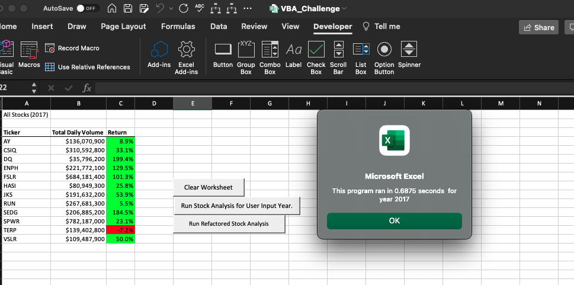
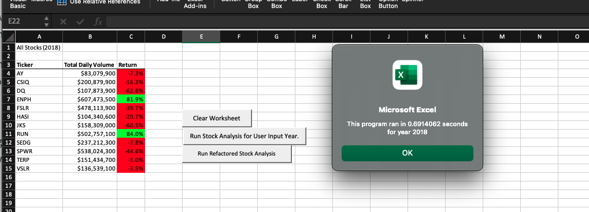
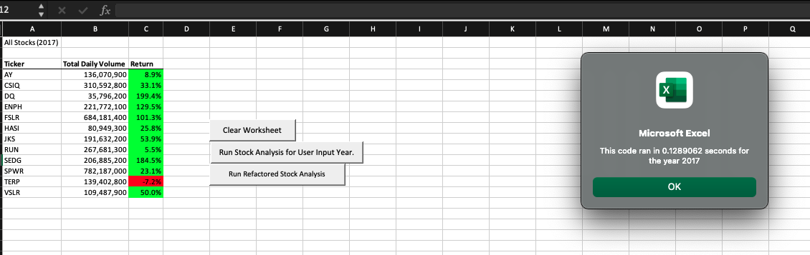
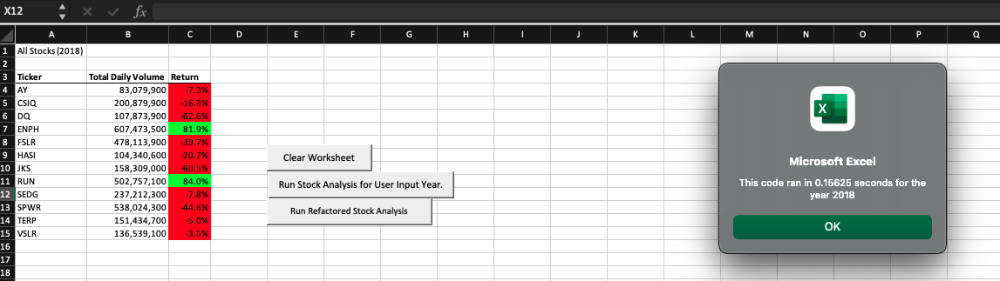
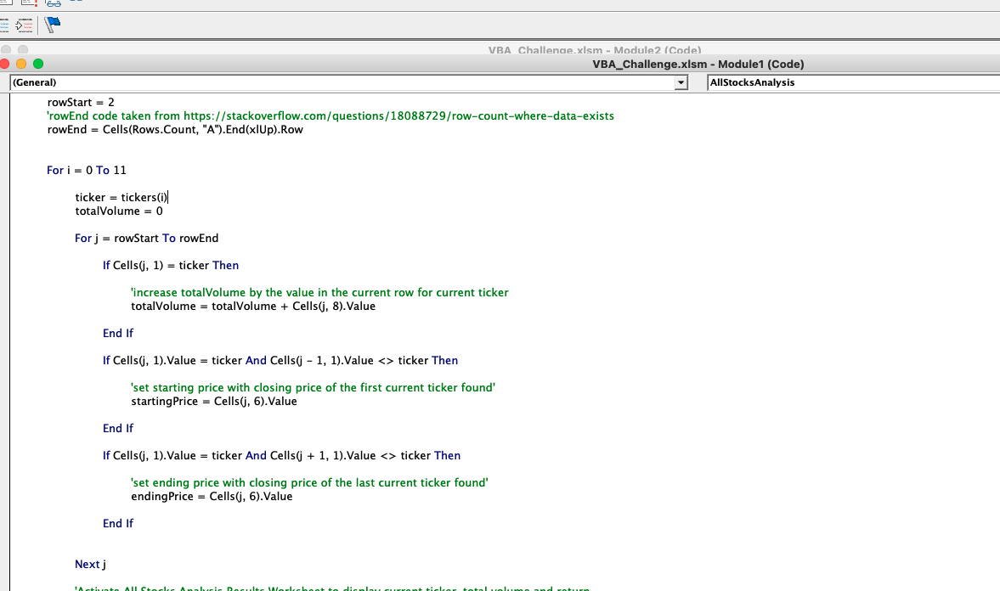
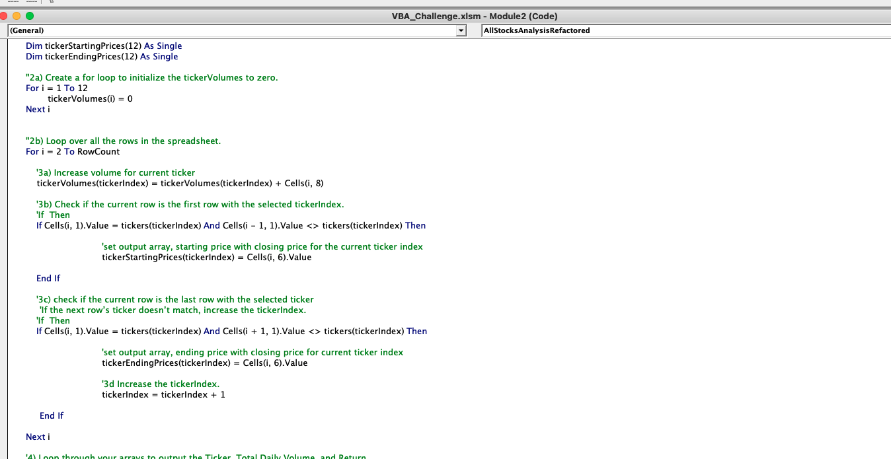

# stock-analysis
### Overview of Project: Explain the purpose of this analysis.
We are making this analysis for Steve who wants to invest his parents funds in a stock that gives maximum returns. For this purpose we are using Excel's VBA progamming application to create an automated stock analysis with a few thousands of stock data.

### Purpose
Our original code works perfect with a few thouhsands of stocks. Now, Steve wants to expand his research for his parents to include the entire stock market. For this reason, we are refactoring our original code to reduce the execution time for large datasets.

#### Results: Using images and examples of your code, compare the stock performance between 2017 and 2018, as well as the execution times of the original script and the refactored script.

Original code run time for 2017

Original code run time for 2018

Refactored code run time for 2017. Run time reduced by 5 times

Refactored code run time for 2018. Run time reduced by 4 times.

In the original code, the program has to iterate through the loop for a total of 12 (no. of tickers) x 3012 (number of data rows). So it takes a longer time to execute this piece of code

In the refactored code, the program only runs once through the entire dataset of 3012 rows.

### Summary: In a summary statement, address the following questions.

### What are the advantages or disadvantages of refactoring code?
  1. Refactoring reduced the program run time by 4 times (almost 5 times) the non-refactored code. This helps to cut down execution time especially for really large datasets.
  2. Code is less complex and easier to understand.
  3. Refactoring may cause a working code to break and we might end up spending more time fixing the errors.

### How do these pros and cons apply to refactoring the original VBA script?
Refactoring the origninal script did lessen the execution time almost four times the original code. It will greatly reduce the execution time when Steve runs this program for the entire stock market.
